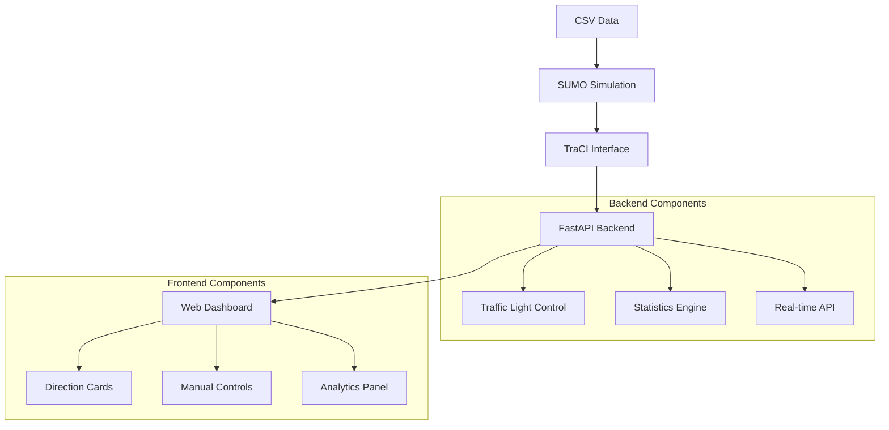
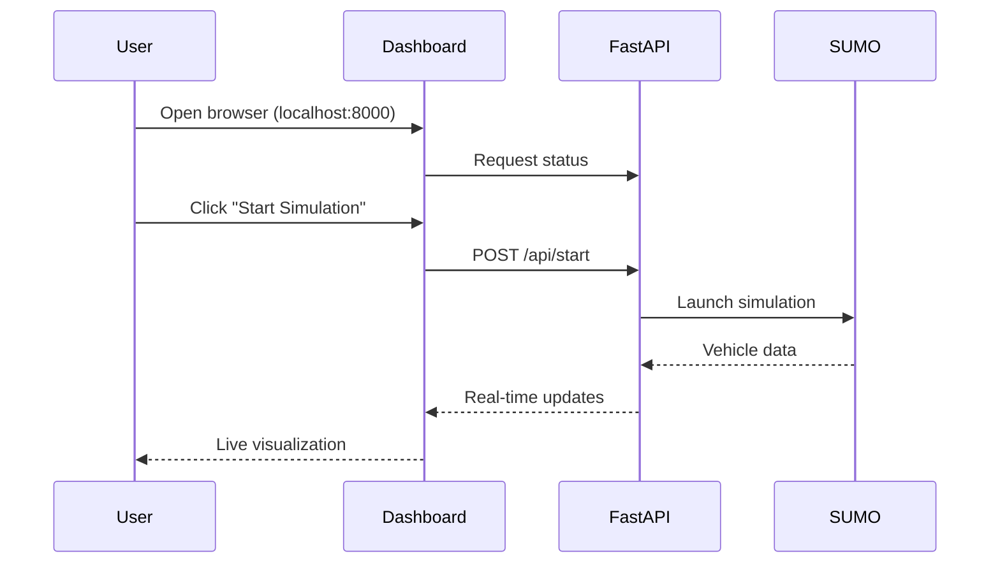

# 🚦 SUMO Traffic Control Dashboard

A comprehensive real-time traffic simulation dashboard built with SUMO (Simulation of Urban MObility), FastAPI, and modern web technologies. This system provides intelligent traffic management with manual control capabilities, real-time analytics, and congestion monitoring.

## 📋 Table of Contents

- [🎯 Overview](#-overview)
- [✨ Features](#-features)
- [🏗️ System Architecture](#️-system-architecture)
- [🔧 Installation & Setup](#-installation--setup)
- [🚀 Getting Started](#-getting-started)
- [📊 Dashboard Features](#-dashboard-features)
- [🎮 Manual Traffic Control](#-manual-traffic-control)
- [📈 Analytics & Statistics](#-analytics--statistics)
- [🔌 API Documentation](#-api-documentation)
- [📁 Project Structure](#-project-structure)
- [🛠️ Configuration](#️-configuration)
- [🐛 Troubleshooting](#-troubleshooting)
- [🤝 Contributing](#-contributing)

## 🎯 Overview

The SUMO Traffic Control Dashboard is an intelligent traffic management system that combines:

- **Real-time traffic simulation** using SUMO
- **Interactive web dashboard** with live data visualization
- **Manual traffic light control** for traffic optimization
- **Advanced analytics** with congestion detection
- **Multi-direction traffic monitoring** (North, South, East, West)
- **CSV data integration** for realistic traffic patterns

### 🎥 System Demo

```
🚦 Dashboard Features:
├── Real-time vehicle tracking
├── Direction-based traffic analysis
├── Manual traffic light control
├── Congestion monitoring
├── Statistics & analytics
└── Multi-configuration support
```

## ✨ Features

### 🔄 Real-Time Monitoring
- **Live vehicle tracking** with position and speed data
- **Direction-based categorization** (North, South, East, West bounds)
- **Real-time congestion analysis** with visual indicators
- **Traffic light status monitoring** with manual override capabilities

### 🎮 Interactive Controls
- **Start/Stop simulation** with one-click controls
- **Configuration switching** between different scenarios
- **Manual traffic light control** for each direction
- **Real-time parameter adjustment**

### 📊 Advanced Analytics
- **Vehicle count tracking** per direction
- **Speed analysis** and congestion detection
- **Peak traffic monitoring**
- **Historical congestion events**
- **Performance statistics**

### 🎨 Modern Interface
- **Responsive design** with Tailwind CSS
- **Real-time updates** without page refresh
- **Interactive notifications**
- **Professional dashboard layout**

## 🏗️ System Architecture



### 🔧 Technology Stack

| Component | Technology | Purpose |
|-----------|------------|---------|
| **Simulation** | SUMO + TraCI | Traffic simulation engine |
| **Backend** | FastAPI + Python | API server and data processing |
| **Frontend** | HTML + JavaScript + Tailwind CSS | Interactive web interface |
| **Data** | CSV + XML | Vehicle data and SUMO configuration |
| **Real-time** | WebSocket-like polling | Live data updates |

## 🔧 Installation & Setup

### 📋 Prerequisites

```bash
# Required Software
- Python 3.12+
- SUMO (Simulation of Urban MObility)
- Modern web browser (Chrome, Firefox, Safari)
```

### 🛠️ Step 1: Install SUMO

#### Windows:
```bash
# Download and install SUMO from official website
# https://eclipse.dev/sumo/
# Add SUMO to your PATH environment variable
```

#### Linux/macOS:
```bash
# Ubuntu/Debian
sudo apt-get install sumo sumo-tools sumo-doc

# macOS with Homebrew
brew install sumo
```

### 📦 Step 2: Install Python Dependencies

```bash
# Clone the repository
git clone <repository-url>
cd SIH2

# Install required packages
pip install -r requirements.txt
```

### 📋 Requirements.txt Content:
```txt
fastapi==0.104.1
uvicorn==0.24.0
traci==1.19.0
sumolib==1.24.0
pandas==2.3.2
pydantic==2.11.10
jinja2==3.1.6
python-dateutil==2.9.0.post0
```

### 🗂️ Step 3: Project Setup

```bash
# Verify project structure
SIH2/
├── dashboard/
│   ├── main.py                 # FastAPI server
│   ├── templates/
│   │   └── index.html         # Dashboard interface
│   └── static/
│       ├── css/style.css      # Custom styles
│       └── js/script.js       # Dashboard logic
├── sumo_intersection/
│   ├── cfg/                   # SUMO configuration files
│   └── routes/                # Traffic route definitions
├── data/
│   └── data2.csv             # Vehicle data
└── scripts/
    └── generate_csv_to_sumo_sorted.py
```

## 🚀 Getting Started

### 1️⃣ Start the Dashboard Server

```bash
# Navigate to project directory
cd C:\PC\Projects\SIH2

# Start the FastAPI server
python dashboard/main.py
```

**Expected Output:**
```
INFO:     Started server process
INFO:     Waiting for application startup.
INFO:     Application startup complete.
INFO:     Uvicorn running on http://0.0.0.0:8000
```

### 2️⃣ Open the Dashboard

```bash
# Open your web browser and navigate to:
http://localhost:8000
```

### 3️⃣ Basic Operation Flow



## 📊 Dashboard Features

### 🎯 Main Dashboard Components

#### 1. **Control Panel**
```html
🎮 Controls:
├── 🟢 Status Indicator (Connected/Disconnected)
├── ⚙️ Configuration Selector
├── ▶️ Start Simulation Button
└── ⏹️ Stop Simulation Button
```

#### 2. **Direction Cards** (4 Sections)

Each direction card displays:
- **Vehicle Count**: Real-time count of vehicles
- **Average Speed**: Speed analysis for congestion detection
- **Congestion Level**: Visual progress bar (Low/Medium/High)
- **Traffic Light Status**: Current signal state
- **Vehicle List**: Individual vehicle details

```javascript
// Direction Categorization Logic
North Bound: vehicle.y > 25
South Bound: vehicle.y < -25  
East Bound:  vehicle.x > 25
West Bound:  vehicle.x < -25
```

#### 3. **Traffic Light Status**

Real-time display for each direction:
- 🔴 **Red**: Stop signal
- 🟡 **Yellow**: Caution signal  
- 🟢 **Green**: Go signal
- **(M)**: Manual mode indicator

### 📈 Congestion Analysis

The system calculates congestion based on:

```python
# Congestion Calculation Algorithm
def calculateCongestion(vehicle_count, avg_speed):
    if vehicle_count > 10 or avg_speed < 5:
        return "High Congestion"
    elif vehicle_count > 5 or avg_speed < 10:
        return "Medium Congestion"
    else:
        return "Low Congestion"
```

## 🎮 Manual Traffic Control

### 🔄 Enabling Manual Mode

1. **Click the Manual Mode Toggle**
   ```
   Manual Mode: [OFF] → [ON]
   ```

2. **System Response:**
   - All traffic lights set to **RED** initially
   - Manual control buttons become active
   - Automatic timing disabled

### 🚦 Individual Light Control

Control each direction independently:

```html
Direction Controls:
├── North ↑: [Green] [Yellow] [Red]
├── East →:  [Green] [Yellow] [Red]  
├── South ↓: [Green] [Yellow] [Red]
└── West ←:  [Green] [Yellow] [Red]
```

### ⚙️ Manual Control API

```python
# Backend API Structure
@app.post("/api/traffic_light/mode")
def set_traffic_light_mode(mode: TrafficLightMode)

@app.post("/api/traffic_light/control")  
def control_traffic_light(control: TrafficLightControl)

# Traffic Light State Format (SUMO)
# "rrrr" = All Red
# "Grrr" = North Green, others Red
# "rGrr" = East Green, others Red
```

### 🔄 Restoring Automatic Mode

Switching back to automatic:
- Clears all manual overrides
- Restores SUMO's built-in timing
- Returns to programmed traffic phases

## 📈 Analytics & Statistics

### 📊 Real-Time Statistics

The dashboard tracks comprehensive metrics:

| Metric | Description | Update Frequency |
|--------|-------------|------------------|
| **Total Vehicles** | Current active vehicles | Every 500ms |
| **Vehicles Passed** | Completed journeys | Real-time |
| **Simulation Time** | Total elapsed time | Continuous |
| **Peak Vehicle Count** | Maximum concurrent vehicles | On change |
| **Congestion Events** | Traffic jam incidents | When detected |

### 🚨 Congestion Detection

Automatic detection triggers when:
```python
# Congestion Event Criteria
- Vehicle Count > 15 vehicles
- OR Average Speed < 3.0 m/s
- Slow Vehicles (< 2.0 m/s) threshold exceeded
```

### 📋 Congestion History

Recent events display:
- **Timestamp**: When congestion occurred
- **Vehicle Count**: Number of vehicles involved
- **Average Speed**: Speed during congestion
- **Slow Vehicle Count**: Vehicles below threshold

### 💾 Data Export

Statistics include:
```json
{
  "total_vehicles_passed": 150,
  "total_simulation_time": 300.5,
  "peak_vehicle_count": 25,
  "congestion_events": [
    {
      "time": 120.5,
      "vehicle_count": 18,
      "avg_speed": 2.1,
      "slow_vehicles": 12
    }
  ]
}
```

## 🔌 API Documentation

### 📡 Core Endpoints

#### **Simulation Control**
```http
GET  /api/status           # Check SUMO connection
POST /api/start            # Start simulation
POST /api/stop             # Stop simulation
POST /api/select_config    # Change configuration
```

#### **Data Retrieval**
```http
GET /api/data              # Full simulation data
GET /api/data/fast         # Optimized data (50 vehicles max)
GET /api/statistics        # Traffic statistics
```

#### **Traffic Light Control**
```http
POST /api/traffic_light/mode     # Enable/disable manual mode
POST /api/traffic_light/control  # Control individual lights
GET  /api/traffic_light/status   # Get current light status
```

### 📊 API Response Examples

#### Vehicle Data Response:
```json
{
  "vehicles": [
    {
      "id": "vehicle_001",
      "x": 45.2,
      "y": -12.8,
      "speed": 8.5
    }
  ],
  "step": 125.5,
  "traffic_lights": {
    "junction_0": {
      "state": "Grrr",
      "manual_mode": true
    }
  }
}
```

#### Statistics Response:
```json
{
  "total_vehicles_passed": 87,
  "total_simulation_time": 245.2,
  "peak_vehicle_count": 19,
  "congestion_events": [...],
  "start_time": "2025-01-06T10:30:00"
}
```

## 📁 Project Structure

```
ITMS/
├── 📂 dashboard/                    # Web Dashboard
│   ├── 🐍 main.py                  # FastAPI server
│   ├── 📂 templates/
│   │   └── 🌐 index.html          # Main dashboard page
│   ├── 📂 static/
│   │   ├── 📂 css/
│   │   │   └── 🎨 style.css       # Custom styles
│   │   └── 📂 js/
│   │       └── ⚡ script.js        # Dashboard logic
│   └── 📂 api/
│       └── 🧪 test_connection.py   # Connection testing
├── 📂 sumo_intersection/           # SUMO Configuration
│   ├── 📂 cfg/
│   │   ├── ⚙️ csv_vehicles.sumocfg # Main config
│   │   └── ⚙️ *.sumocfg           # Other scenarios
│   ├── 📂 routes/
│   │   └── 🛣️ *.rou.xml           # Route definitions
│   └── 📂 networks/
│       └── 🗺️ *.net.xml            # Road networks
├── 📂 data/
│   └── 📊 data2.csv               # Vehicle input data
├── 📂 scripts/
│   └── 🔄 generate_csv_to_sumo_sorted.py # Data conversion
└── 📄 requirements.txt             # Python dependencies
```

### 🗂️ Key Files Description

| File | Purpose | Technology |
|------|---------|------------|
| `main.py` | Backend API server | FastAPI + TraCI |
| `index.html` | Dashboard interface | HTML + Tailwind CSS |
| `script.js` | Frontend logic | Vanilla JavaScript |
| `csv_vehicles.sumocfg` | SUMO configuration | XML |
| `data2.csv` | Vehicle data source | CSV |

## 🛠️ Configuration

### ⚙️ SUMO Configuration Files

#### Main Config (`csv_vehicles.sumocfg`):
```xml
<configuration>
    <input>
        <net-file value="../networks/intersection.net.xml"/>
        <route-files value="../routes/csv_vehicles_sorted.rou.xml"/>
    </input>
    <time>
        <begin value="0"/>
        <end value="3600"/>
    </time>
</configuration>
```

### 🚗 Vehicle Data Format (`data2.csv`):
```csv
vehicle_id,departure_time,vehicle_type,route,max_speed,color
car_001,10,car,north_to_south,15.0,red
truck_002,15,truck,east_to_west,12.0,blue
bus_003,20,bus,south_to_north,13.0,green
```

### 🛣️ Route Definitions:
```python
route_definitions = {
    'north_to_south': 'A0 C1',
    'north_to_east': 'A0 D1',
    'east_to_west': 'D0 B1',
    'south_to_north': 'C0 A1'
    # ... more routes
}
```

### ⚡ Performance Settings:

```python
# Dashboard Update Intervals
updateInterval: 500ms      # Data refresh rate  
statusInterval: 3000ms     # Status check rate
dataCache: enabled         # Response caching
maxVehicles: 50           # Display limit for performance
```

## 🐛 Troubleshooting

### ❌ Common Issues & Solutions

#### **1. SUMO Connection Failed**
```bash
Error: [WinError 10038] An operation was attempted on something that is not a socket

Solutions:
✅ Check if SUMO is installed and in PATH
✅ Close any existing SUMO processes
✅ Restart the dashboard server
```

#### **2. Dashboard Shows "Disconnected"**
```bash
Status: Disconnected

Solutions:
✅ Click "Start Simulation" button
✅ Verify SUMO configuration file exists
✅ Check console for error messages
```

#### **3. No Vehicles Appearing**
```bash
Vehicle Count: 0 (all directions)

Solutions:
✅ Check CSV data file exists and has valid data
✅ Verify departure times are properly sorted
✅ Check route definitions match network
```

#### **4. Manual Mode Not Working**
```bash
Manual controls not responding

Solutions:
✅ Ensure simulation is running before enabling manual mode
✅ Check browser console for JavaScript errors
✅ Verify TraCI connection is active
```

#### **5. Performance Issues (Slow Updates)**
```bash
Dashboard updates are delayed

Solutions:
✅ Reduce update interval in script.js
✅ Limit vehicle display count
✅ Close unnecessary browser tabs
✅ Use /api/data/fast endpoint
```

### 🔍 Debug Mode

Enable debug logging:
```python
# Add to main.py for detailed logging
import logging
logging.basicConfig(level=logging.DEBUG)

# Browser console debugging
debugTrafficLights()  # Run in browser console
```

### 📊 System Requirements

| Component | Minimum | Recommended |
|-----------|---------|-------------|
| **RAM** | 4GB | 8GB+ |
| **CPU** | Dual-core | Quad-core+ |
| **Storage** | 500MB | 1GB+ |
| **Browser** | Chrome 90+ | Latest version |
| **Python** | 3.8+ | 3.9+ |

## 🚀 Advanced Features

### 🔄 Multi-Configuration Support

Switch between different scenarios:
```bash
Available Configurations:
├── csv_vehicles.sumocfg      # Main CSV-based simulation
├── basic_intersection.sumocfg # Simple 4-way intersection  
├── heavy_traffic.sumocfg     # High-density traffic
└── emergency_scenario.sumocfg # Emergency vehicle priority
```

### 📊 Data Analytics Integration

Export data for analysis:
```python
# Statistics API provides data for:
- Traffic pattern analysis
- Congestion prediction
- Signal optimization
- Performance metrics
```

### 🎯 Future Enhancements

Planned features:
- 📈 **Real-time charts** with Chart.js integration
- 🚨 **Emergency vehicle priority** system
- 🤖 **AI-based signal optimization**
- 📱 **Mobile responsive design**
- 💾 **Database integration** for historical data
- 🔔 **Alert system** for traffic anomalies

## 🤝 Contributing

### 🛠️ Development Setup

```bash
# Fork the repository
git clone <your-fork-url>
cd SIH2

# Create development branch
git checkout -b feature/your-feature-name

# Install development dependencies
pip install -r requirements-dev.txt

# Make changes and test
python dashboard/main.py

# Submit pull request
```

### 📋 Contribution Guidelines

1. **Code Style**: Follow PEP 8 for Python, ESLint for JavaScript
2. **Testing**: Add tests for new features
3. **Documentation**: Update README for any new features
4. **Compatibility**: Ensure SUMO compatibility across versions

### 🐛 Bug Reports

Please include:
- System information (OS, Python version, SUMO version)
- Error messages and logs
- Steps to reproduce
- Expected vs actual behavior

## 📄 License

This project is licensed under the MIT License - see the [LICENSE](LICENSE) file for details.

## 🙏 Acknowledgments

- **SUMO Team** for the excellent traffic simulation platform
- **FastAPI** for the modern API framework
- **Tailwind CSS** for the utility-first CSS framework
- **TraCI** for the SUMO control interface

## 📞 Support

For support and questions:
- 📧 Email: [your-email@example.com]
- 🐛 Issues: [GitHub Issues](https://github.com/your-repo/issues)
- 📖 Documentation: [Project Wiki](https://github.com/your-repo/wiki)

---

**🚦 Built with ❤️ for intelligent traffic management**

*Last updated: October 2025*